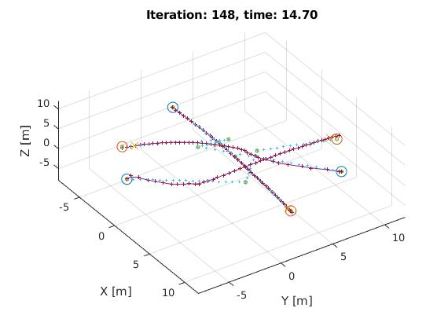
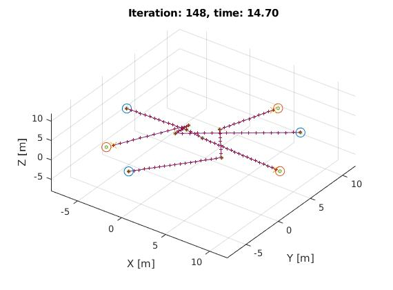

# MATLAB UTILITIES
Matlab utility library with useful scripts on various trajectory and planning algorithms

---

## In Progress (Quadcopter Swarm)
Implementing `ZJU EGO-SWARM` **flight deconfliction** and **obstacle avoidance** using unconstrained optimization

| Optimization | Without Optimization |
| :----: | :----: |
||  |

Currently, `scripts/simulation/egoSimulationTemplate.m` yields the current updated progress

1. Simulation generates random positions for the quadcopter and designated waypoints
2. Uniformly distribute control points across the lines connecting the waypoints
3. Calculate `position` and `velocity` from bspline De Boor-Cox algorithm using matrix representation at desired time intervals
```
1. Setup [Time]
2. Setup [Boundary]
	- Setup simulator boundary and field
3. Setup [UAV]
	- Initiate number of quadcopters
	- Give an ideal path without including system dynamics
	- Planning horizon
4. Setup other variables
	- Able to load saved waypoints and quadcopter setup for playback
	- Able to save current quadcopter settings and path
	- Able to disable replanning and view Bspline trajectory
5. BSpline settings
	- Set order and waypoint size
6. Optimizer
```

Use `scripts/simulation/bsplineSimulationTemplate.m` for visualization of bspline path

cc

---

## Index
- `functions` : Contains of helper functions, use the `addpath` to include the functions path
```matlab
funct_path = '*dir*'; addpath(strcat(funct_path,'/*type*'));
```
- `scripts` : Contains of example scripts of scripts to derive `functions`
```
Consisting of
   - Bspline
   - Simulation
```
- `class` : Contains of classes for the various simulation objects, currently it contains the `quadcopter` class for simulations

- `params` : Contains parameters to initialize the `quadcopter` class
